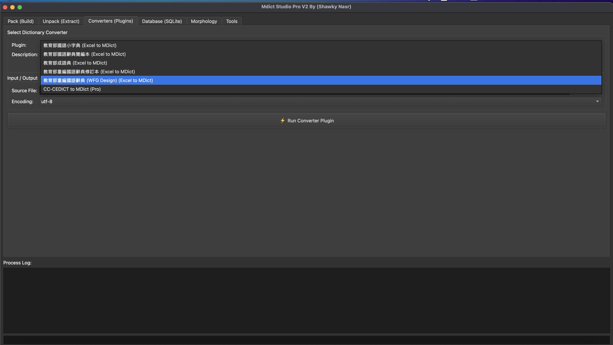
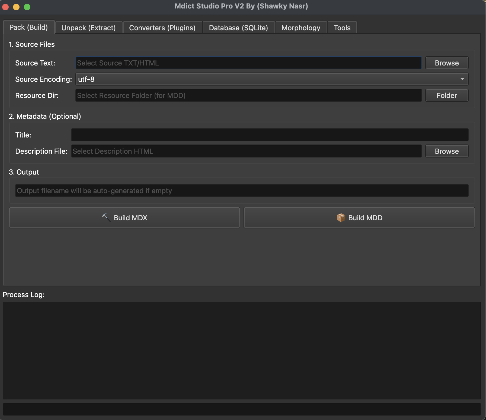
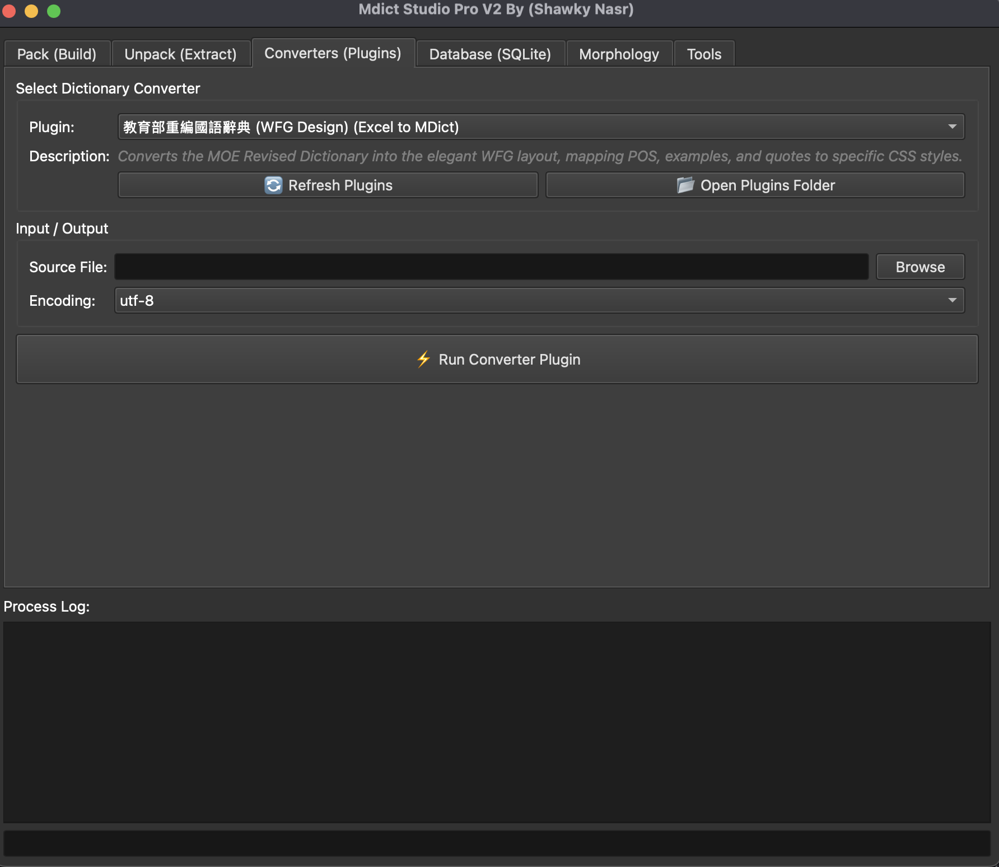
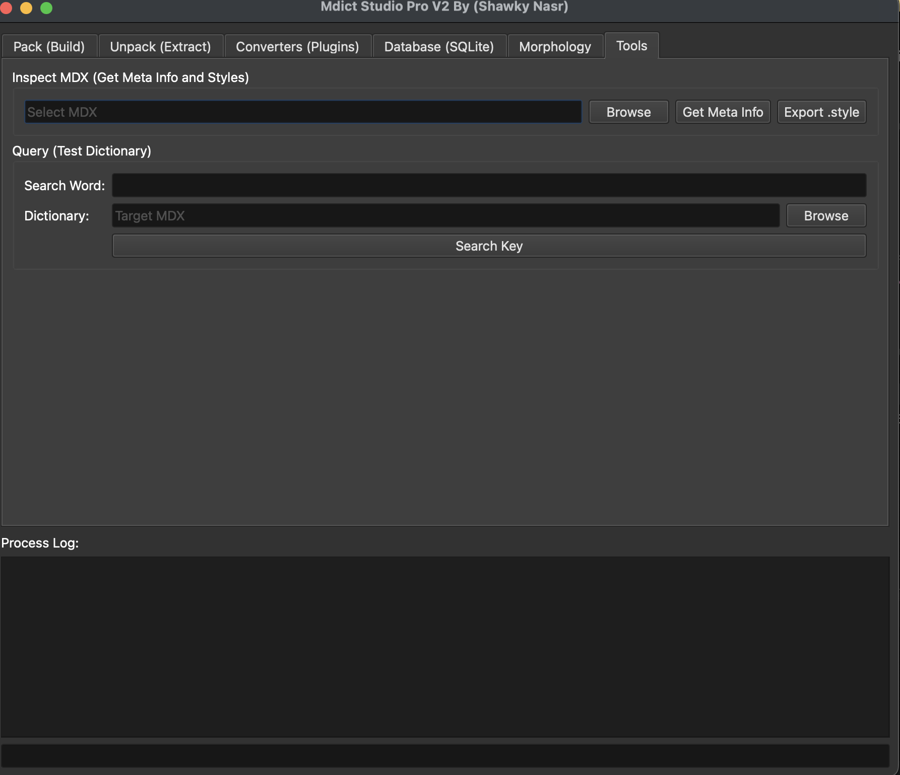
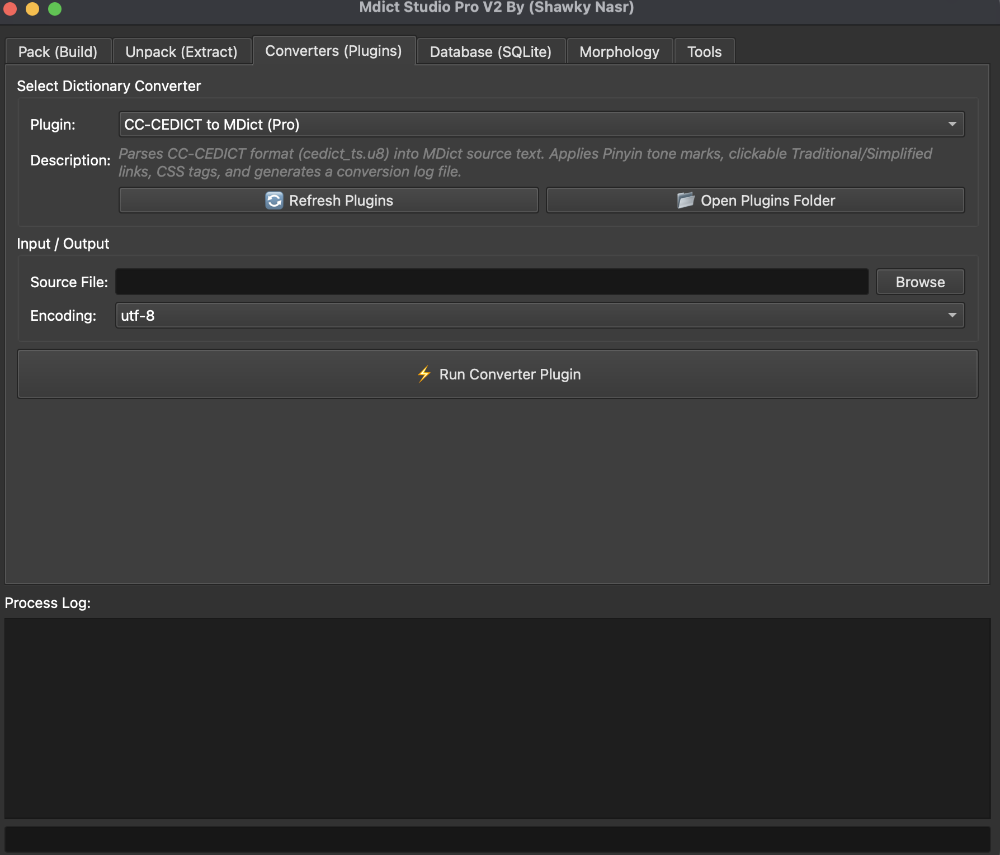
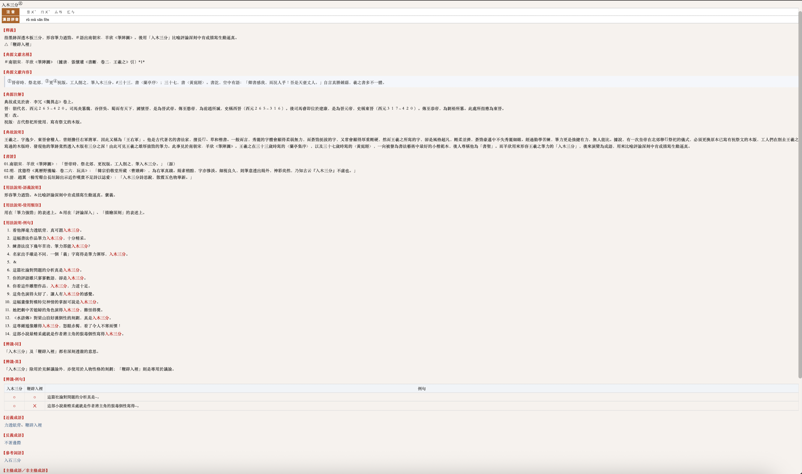

# Mdict Studio Pro

[English](README.md) | [简体中文](README.zh-CN.md) | [繁體中文](README.zh-TW.md) | **العربية**

<div dir="rtl" align="right">

**أداة سطح مكتب حديثة تعمل على أنظمة تشغيل متعددة، لبناء وتحويل وفحص ملفات قواميس MDict.**

يوفّر Mdict Studio Pro سير عمل MDict الكامل — حزم وفك حزم ملفات ‎`.mdx`‎/‎`.mdd`‎، وتحويل بيانات القواميس الخام إلى نص مصدر MDict، وإدارة عمليات البحث المعتمدة على SQLite، وفحص القواميس المُجمَّعة — كل ذلك من خلال واجهة رسومية واحدة مستقلة بذاتها. صُمم هذا التطبيق للغويين وهواة صناعة القواميس والمطورين الذين يتعاملون مع بيانات معجمية منظَّمة.

</div>



---

<div dir="rtl" align="right">

## جدول المحتويات

- [الجديد في الإصدار V2.0](#الجديد-في-الإصدار-v20)
- [المزايا](#المزايا)
- [لقطات الشاشة](#لقطات-الشاشة)
- [التثبيت](#التثبيت)
- [الاستخدام](#الاستخدام)
- [كتابة إضافات مخصّصة](#كتابة-إضافات-مخصّصة)
- [أمثلة على المخرجات](#أمثلة-على-المخرجات)
- [المساهمة](#المساهمة)
- [الترخيص والمؤلف](#الترخيص-والمؤلف)

</div>

---

## الجديد في الإصدار V2.0

<div dir="rtl" align="right">

الميزة الرئيسية في الإصدار V2.0 هي **نظام إضافات المحوّلات (Converter Plugin System)** — محرك تنفيذ نمطي (modular) يحل محل منطق التحليل المُدمج والمخصص لصيغة واحدة فقط.

يكفي وضع ملف الإضافة في مجلد الإضافات الخاص بالتطبيق ليقوم Mdict Studio Pro باكتشافه تلقائيًا، وبناء نموذج الإدخال الخاص به استنادًا إلى البيانات الوصفية المُعلَنة داخل الإضافة، وتشغيله في خيط (thread) خلفي — دون الحاجة لأي تعديل على التطبيق الأساسي. هذا يعني أن بإمكان أي شخص كتابة محوّل لصيغة قاموس غير مدعومة أصلاً في التطبيق، دون الحاجة إلى عمل fork لقاعدة الشيفرة بأكملها.

</div>

## المزايا

<div dir="rtl" align="right">

- **إضافات محوّلات نمطية** — اكتب فئة Python واحدة ترث من `BaseConverterPlugin` لتحليل أي صيغة مصدر (Excel، CSV، XML، أو تنسيقات نصية مخصصة) وتحويلها إلى مصدر MDict. تقوم الواجهة الرسومية بإنشاء نموذج الإدخال تلقائيًا استنادًا إلى الإضافة.
- **حزم / فك حزم ملفات `.mdx` و`.mdd`** — قم ببناء قواميس مُجمَّعة من نص مصدري (مع إمكانية إضافة مجلدات موارد اختيارية لملفات `.mdd`)، أو استخرج القواميس الحالية مرة أخرى إلى نص مصدري.
- **تحكم متقدم في التنسيق الطباعي** — يمكن للإضافات إنتاج HTML دلالي، بما في ذلك وسوم `<ruby>` لتوضيح النطق (Bopomofo/Pinyin)، وقوائم تعريف `<ol>` منظَّمة، وتخطيط مدفوع بـ CSS.
- **دعم قوي لترميزات النصوص الصينية/اليابانية/الكورية (CJK)** — معالجة موثوقة لملفات المصدر بترميزات UTF-8 وUTF-16LE وBig5 وGBK وGB18030.
- **تكامل مع قواعد بيانات SQLite** — التحويل بين مصادر النصوص/MDX الخام وقواعد بيانات SQLite لإجراء استعلامات برمجية سريعة.
- **أدوات فحص ملفات MDX** — استخراج البيانات الوصفية المُضمَّنة وأوراق الأنماط `.style‎` (CSS) من ملف `.mdx‎` مُجمَّع، أو تشغيل استعلامات اختبارية على القاموس مباشرة من داخل الواجهة.
- **دعم الصرف اللغوي (Morphology)** — دمج بيانات التصريف الخارجية (‎`addflex.py`‎، ‎`wordforms.txt`‎) لبناء قواميس تدعم البحث بالجذر والتصريف.
- **متعدد المنصات** — يعمل على macOS وWindows وLinux.

</div>

## لقطات الشاشة

<div dir="rtl" align="right">

| الحزم (Pack) | المحوّلات (الإضافات) | الأدوات |
|---|---|---|
|  |  |  |

</div>

## التثبيت

<div dir="rtl" align="right">

**المتطلبات:**
- Python 3.8 أو أحدث
- [mdict-utils](https://github.com/liuyug/mdict-utils) (يوفّر أداة سطر الأوامر `mdict` التي تعتمد عليها عمليات الحزم/فك الحزم/قاعدة البيانات)

**1. استنساخ المستودع**
</div>

```bash
git clone https://github.com/shawkynasr/MdictStudioPro.git
cd MdictStudioPro
```

<div dir="rtl" align="right">

**2. تثبيت المتطلبات**
</div>

```bash
pip install -r requirements.txt
```

<div dir="rtl" align="right">

**3. تشغيل التطبيق**
</div>

```bash
python MdictStudio.py
```

<div dir="rtl" align="right">

> **تجميع النسخة الخاصة بـ macOS:** يمكن تجميع التطبيق إلى حزمة ‎`.app‎`‎/‎`.dmg‎` أصلية باستخدام PyInstaller. راجع [`docs/BUILD.md`](docs/BUILD.md) لمعرفة خطوات التجميع، أو احصل على نسخة جاهزة من [صفحة الإصدارات](https://github.com/shawkynasr/MdictStudioPro/releases).

</div>

## الاستخدام

<div dir="rtl" align="right">

يُقسَّم التطبيق إلى ستة تبويبات، يغطي كل منها مرحلة من مراحل سير عمل MDict:

| التبويب | الوظيفة |
|---|---|
| **الحزم (Pack)** | تجميع النص المصدري (وأي موارد اختيارية) إلى ‎`.mdx‎`‎/‎`.mdd‎`. |
| **فك الحزم (Unpack)** | استخراج ملف ‎`.mdx‎`‎/‎`.mdd‎` موجود مرة أخرى إلى نص مصدري. |
| **المحوّلات (الإضافات)** | تشغيل إضافة محوّل لتحويل بيانات خام إلى مصدر MDict. |
| **قاعدة البيانات (SQLite)** | التحويل بين مصادر النص/MDX وقواعد بيانات SQLite. |
| **الصرف اللغوي** | بناء بيانات التصريف لدعم البحث بالجذر. |
| **الأدوات** | فحص بيانات/أنماط MDX الوصفية، أو تشغيل استعلامات اختبارية. |

</div>

## كتابة إضافات مخصّصة

<div dir="rtl" align="right">

إنشاء محوّل قاموس جديد يتطلب ملفًا واحدًا فقط. أنشئ ملف ‎`.py‎` داخل مجلد الإضافات، وورِّثه من `BaseConverterPlugin`:

</div>

```python
from base_plugin import BaseConverterPlugin

class MyCustomDictPlugin(BaseConverterPlugin):
    id = "my_custom_dict_v1"                 # معرّف داخلي فريد
    name = "My Custom Dictionary"             # الاسم الظاهر في قائمة المحوّلات
    description = "يحلّل صيغة قاموس معينة ويحوّلها إلى HTML بصيغة MDict."
    file_filter = "Excel Files (*.xlsx);;All Files (*.*)"
    default_encodings = ["utf-8"]

    def convert(self, input_file, output_file, encoding, progress_callback, log_callback):
        # 1. أضف منطق التحليل الخاص بك هنا
        # 2. الإبلاغ عن التقدم: progress_callback(50)
        # 3. تسجيل الحالة:      log_callback("جارٍ معالجة المدخلات...")

        return "تم إنشاء مصدر MDict بنجاح!"
```

<div dir="rtl" align="right">

سيكتشف Mdict Studio Pro الإضافة تلقائيًا عند التشغيل التالي (أو عبر زر **تحديث الإضافات** في تبويب المحوّلات)، ويقوم ببناء نموذج الإدخال — منتقي الملفات، ومنتقي الترميز، وأي خيارات مخصّصة أخرى — تلقائيًا استنادًا بالكامل إلى ما تُعلنه الفئة.

**أين توضع الإضافة:**
- عند التشغيل من الشيفرة المصدرية: ضعها داخل مجلد ‎`plugins/‎` بجانب ‎`MdictStudio.py‎`.
- عند تشغيل التطبيق المُجمَّع: استخدم المسار ‎`~/Documents/Mdict Studio Pro/plugins‎` (يُنشأ تلقائيًا عند أول تشغيل — اضغط على **فتح مجلد الإضافات** في تبويب المحوّلات للانتقال إليه مباشرة).

يجب أن يكون `id` فريدًا بين جميع الإضافات المثبَّتة؛ أما `name` فهو مجرد تسمية عرض ويمكن أن يكون وصفيًا (بما في ذلك استخدام حروف غير لاتينية — راجع الإضافات النموذجية أدناه).

> **ملاحظة ترخيص لمؤلفي الإضافات:** بما أن Mdict Studio Pro يُوزَّع بموجب رخصة AGPL-3.0 (انظر أدناه)، يُتوقَّع أن تكون الإضافات التي يتم تحميلها وتوزيعها مع التطبيق متوافقة مع هذه الرخصة. إذا كنت تبني إضافة خاصة/داخلية للاستخدام الشخصي فقط، فهذا لا يؤثر عليك.

</div>

## أمثلة على المخرجات

<div dir="rtl" align="right">

بعض القواميس التي تم إنشاؤها باستخدام إضافات محوّلات مجتمعية/نموذجية، وتوضّح مستوى التفاصيل الطباعية التي يدعمها مسار معالجة HTML — نطق Pinyin مع علامات النبرة، وعلامات صنف الكلمة الملوَّنة، والإحالات المرجعية المنظَّمة:

</div>

<table>
<tr>
<td></td>
<td></td>
</tr>
</table>

<div dir="rtl" align="right">## شكر وتقدير ومصادر المشروع (Credits & References)

تم بناء Mdict Studio Pro بالاعتماد على جهود ومشاريع مجتمع تطوير القواميس مفتوحة المصدر:

- **النواة والمحرك الأساسي:**
  - تم تصميم الواجهة الرسومية بناءً على المشروع الأصلي *mdictGui* للمطور **jekovcar**.
  - يعتمد على محرك **[mdtt](https://github.com/libukai/mdtt)** للمطور libukai ومكتبة **[mdict-utils](https://github.com/liuyug/mdict-utils)**.

- **ملفات التنسيق والأنماط (CSS):**
  - تنسيق `cbgycd.css` (نمط WFG) مبني على التصميم الأصلي للمطور **DFL**.
  - تنسيق `jybcb.css` لتخطيط وعرض القواميس مبني على تحسينات **bmcc718**.

- **الإضافات ومعالجة البيانات (Plugins):**
  - منطق التحويل في `edudict_plugin.py` مبني على السكربت الأصلي للمطور **kking**.
  - معالجة وتحويل بيانات CC-CEDICT مبنية على عمل المطور **shbf@PDAWIKI**.

</div>

## المساهمة

<div dir="rtl" align="right">

المساهمات، والإبلاغ عن المشكلات، وطلبات المزايا الجديدة كلها موضع ترحيب — تفضّل بزيارة [صفحة المشكلات (issues)](https://github.com/shawkynasr/MdictStudioPro/issues) للبدء.

إذا قمت بكتابة إضافة محوّل لصيغة قاموس معروفة، يُرجى فتح طلب سحب (Pull Request) لإدراجها كإضافة افتراضية/نموذجية.

</div>

## الترخيص والمؤلف

<div dir="rtl" align="right">

- **المؤلف:** Shawky Nasr
- **للتواصل:** shawkynasr@126.com
- **الترخيص:** [رخصة جنو أفيرو العمومية العامة الإصدار 3.0 (AGPL-3.0)](LICENSE)

يستخدم هذا المشروع مكتبة [PyQt6](https://www.riverbankcomputing.com/software/pyqt/)، المرخَّصة بشكل مزدوج بموجب GPL v3 أو ترخيص تجاري. لذلك يُوزَّع Mdict Studio Pro بموجب رخصة AGPL-3.0 تبعًا لذلك.

</div>
